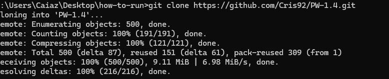
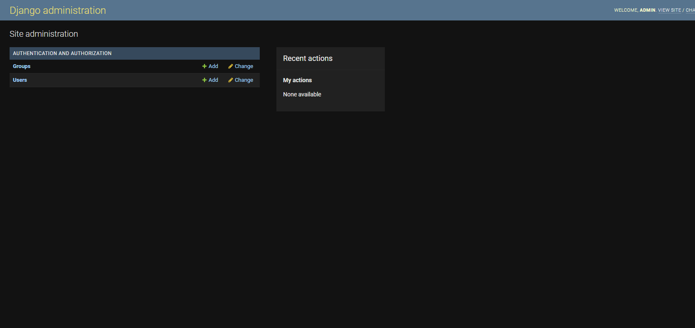

# Indice
- [Hotel Pegaso - Sistema di Prenotazione](#hotel-pegaso---sistema-di-prenotazione)
  - [Tecnologie Utilizzate](#tecnologie-utilizzate)
  - [Altre Info](#altre-info)
    - [Conventional Commit](#conventional-commit)
    - [Struttura del Progetto](#struttura-del-progetto)
  -[Come Funziona L'applicazione](#come-funziona-lapplicazione)
    -[Framework Django](#framework-django)
    -[Definizione degli oggetti](#definizione-degli-oggetti)
    -[Definizione dei template](#definizione-dei-template)
    -[Logiche](#logiche)
    -[Forwarding](#forwarding)
  -[How To Run](#how-to-run)
  -[Punti salienti durante lo sviluppo](#punti-salienti-durante-lo-sviluppo)
    -[Prerequisiti](#prerequisiti)
    -[Fasi di Sviluppo](#fasi-di-sviluppo)
  -[Generazione Infrastruttura cloud Azure tramite IaC](#generazione-infrastruttura-cloud-azure-tramite-iac)
  -[Gestione CI/CD](#gestione-cicd)
  -[Improvements](#improvements)
  -[Biblio](#bibliography)

# Hotel Pegaso - Sistema di Prenotazione

Questo progetto implementa un sistema di prenotazione per l'Hotel Pegaso utilizzando Django come framework backend.
Per i docenti, per vedere come lanciare il progetto andare su [How To Run](#how-to-run)

## Tecnologie Utilizzate

 - Visual Studio Code
 - Git
 - WinGet
 - Azure
 - Github Actions
 - Terraform
 - Python


## Altre Info

### Conventional Commit

Il progetto viene gestito seguendo le indicazioni di [conventional commit](https://www.conventionalcommits.org/en/v1.0.0/) 
Per utilizzare al meglio le convenzioni ho utilizzato cz-commit.
Per installarlo prima di tutto ci serve NPM
```cmd
winget install Node.js
```

Successivamente installo il tool utilizzando 

```cmd
npm i cz-customizable -g
```

Successivamente creo un file .cz-config.js nella root di progetto e copio il contenuto di https://github.com/leoforfree/cz-customizable/blob/master/.cz-config.js al suo interno.
Dopodichè invece che eseguire le commit, successivamente al git add, eseguo
 
```cmd
cz-cust
```

e avrò degli step interattivi per eseguire una commit secondo le convenzioni

### Struttura del Progetto

- **hotel_pegaso/**: Contiene l'app principale del progetto.
  - **booking/**: Contiene i file necessari per il funzionamento della Django app.
    - **migrations/**: Contiene i file di migrazione generati da Django durante il makemigrations
    - **static/**: Contiene i file statici utilizzati dalla parte frontend dell'applicazione, contenente css,images e javascripts
    - **templates/**: Contiene i file html che verranno utilizzati da Django tramite Jinja per generare dinamicamente le pagine web
    - **admin.py**: Il file che gestisce la pagina di admin della webapp, permettendoci di definire filtri e views oltre a registrare i model che sono da gestire manualmente
    - **apps.py**: Il file che gestisce le metainformazione dell'app Django
    - **models.py**: Il file al cui interno vengono definiti i modelli dell'app
    - **tests.py**: Il file contenente gli unit test che verranno eseguiti durante il deploy
    - **urls.py**: File contente il mapping tra le url e le views
    - **views.py**: File contente le logiche di renderizzazione e le logiche di controller dell'app
    
  - **hotel_pegaso/**: Contiene i file di configurazione del Django Project.
    - **manage.py**: Script di gestione del progetto Django.
  - **media/**: Cartella contenente quelle che nel caso del progetto saranno le immagini delle stanze, e quindi tutto quello che viene dinamicamente inserito dall'utente riferito ai modelli


## Come Funziona L'applicazione

### Framework Django
Per il progetto è stato scelto di utilizzare come framework Django.
Questo perchè oltre ad offrire una facile integrazione con l'interfaccia web, e la possibilità di creare qualcosa di simile ad una one page application,
offre altre utili funzionalità, prima tra tutte un ORM integrato, ed una facile integrazione con sistemi cloud.
Inoltre ci offre un'interfaccia di gestione degli oggetti in modo automatico grazie a Django Admin.
Manteniamo inoltre una facile separazione per il modello MTV(Model Template View)
Andiamo ora ad analizzare più a fondo come è composto il progetto


### Definizione degli oggetti
Una volta definita l'analisi del progetto, ho potuto facilmente andare a creare i modelli che avrebbero composto l'applicazione.
Grazie all'integrazione con un ORM, andiamo a definire i modelli nel file models.py.
Questo ci da la possibilità di andare a modificare automaticamente il database a seguito di modifiche grazie ai comandi makemigrations e migrate disponibili sul manage.py.
Essendo oggetti abbastanza semplici, al proprio interno andiamo a definire la tipologia dei campi, oltre, lì dove serve, a funzionalità di base.
Ad esempio per la classe Room, andiamo a definire delle semplici funzioni che ci forniscono le medie dei voti e il numero di stelle da rappresentare a video.

### Definizione dei template
Andiamo invece ad analizzare la parte di templating.
In Django ciò è molto semplice.
Andiamo innanzitutto a definire i file .html all'interno della cartella template(cartella definibile all'interno di settings.py).
Nel caso di questo progetto specifico, vediamo l'utilizzo di nesting che ci permettono di definire una volta sola componenti come navbar e footer, che saranno presenti più volte.

Infatti, possiamo inserire un html all'interno di un'altro, tramite il tag  
```html

```
All'interno del file navbar.html, vediamo un utilizzo invece del tag condizionale, per gestire la pagina dove siamo attualmente

```html
<a class="nav-link active"
```

Qui, andiamo a visualizzare il nome della pagina e in caso corrisponda all'url definita nella navbar, andiamo a settare la classe "active", in modo da evidenziare differentemente la scritta in base alla pagina su cui ci troviamo

### Logiche
Le logiche applicative le andiamo a definire all'interno del file views.py.
Qui inseriamo varie logiche applicative per il retrieve delle stanze, della prenotazione, e di aggiornamento ed eliminazione.

### Forwarding
La connessione tra l'indirizzo e il template/le logiche avviene tramite il file urls.py.
Qui andiamo semplicemente ad associare un path ad una funzione definita in views.py

```python
path('booking/<int:booking_id>/edit/', views.edit_booking_view, name='edit_booking_view'),
```

Ad esempio nel caso sopra, andiamo a definire che il path booking/1/edit richiami la funzione views.edit_booking_view. Inoltre le associamo un nome che potrà poi essere gestito all'interno del codice.
Notiamo come il booking_id venga definito all'interno del path e Django si occupera automaticamente di valorizzarlo nella funzione associata, semplicemente grazie al fatto che il nome definito qui, e il nome della variabile è lo stesso.


## How To Run

### Prerequisiti

- **Python 3.x** deve essere installato sul sistema.
- **git** Per gestire il clone del repository.

#### Clone Repository

Prima di tutto su cartella nuova, aprire un terminale e usare comando 

```bash
git clone https://github.com/Cris92/PW-1.4.git
```



#### Installazione Ambiente
Lanciare il comando 

```bash
python -m venv venv
```
Per generare il virtual_environment

E attivarlo usando

 Linux/macOS
 ```bash
source venv/bin/activate
```
Windows
```bash
venv\Scripts\activate  
```
Dopodichè navigare nella cartella

"clonepath"\PW-1.4\hotel_pegaso

E successivamente lanciare 

```bash
pip install -r requirements.txt
```
Per l'installazione delle dipendenze.

A questo punto andare nella cartella

"clonepath"\PW-1.4\hotel_pegaso\hotel_pegaso

e lanciare

```bash
python manage.py runserver
```

A questo punto si potrà navigare su http://localhost:8000/ per visionare la webapp.

Se tutto funziona, fare CTRL+C per chiudere la webapp e lanciare

```bash
python3 manage.py createsuperuser
```

Qui completare i campi dopodichè restartare il server con il comando runserve e navigare su

http://localhost:8000/admin

Inserendo i dati inseriti prima come superuser si potrà navigare nel menù di admin per gestire manualmente i models.

Il database sarà già precaricato con i dati inseriti da me in fase di sviluppo, avendo caricato in repository anche il file db.sqllite3

Vi ringrazio per l'attenzione e spero che il progetto sia di vostro gradimento.

## Punti salienti durante lo sviluppo


### Fasi di Sviluppo

**Creo un ambiente virtuale** (opzionale ma raccomandato):

```bash
python -m venv myenv
```

**Attivo l'ambiente virtuale**:
  
```bash
myenv\Scripts\activate
```

**Installo Django**:

   Con l'ambiente virtuale attivato, esegui:

```bash
pip install django
```

**Creo un nuovo progetto Django**:

```bash
django-admin startproject hotel_pegaso
cd hotel_pegaso
```

**Creo una nuova app Django**:

```bash
python manage.py startapp booking
```

**Configuro il progetto**:

   - Aggiungi `booking` a `INSTALLED_APPS` in `settings.py`.
```bash
   INSTALLED_APPS = [
    'django.contrib.admin',
    'django.contrib.auth',
    'django.contrib.contenttypes',
    'django.contrib.sessions',
    'django.contrib.messages',
    'django.contrib.staticfiles',
    #Aggiungi qui
    'booking',
]
```

**Eseguo le migrazioni iniziali**:

```bash
python manage.py migrate
```

**Creo un superutente** (facoltativo):

```bash
python manage.py createsuperuser
```

**Avvio il server di sviluppo**:

```bash
python manage.py runserver
```
**Verifico corretta installazione**:

```bash
curl http://127.0.0.1:8000
```
Se tutto è stato installato correttamente dovreste avere una response, altrimenti se navigate tramite browser, vedrete questo:


**Generazione file statici**

Vado a creare la cartella che conterra i templates e ad inserire il codice

```bash
   mkdir templates/
   mkdir static/
```

e vado a creare i file che comporranno le pagine

#### index.html
```html


<!DOCTYPE html>
<html lang="it">

<head>
    <meta charset="UTF-8">
    <meta name="viewport" content="width=device-width, initial-scale=1.0">
    <title>Hotel Pegaso - Homepage</title>
    <!--Importo i css necessari online -->
    <link href="https://cdn.jsdelivr.net/npm/bootstrap@5.3.0/dist/css/bootstrap.min.css" rel="stylesheet">
    <link rel="stylesheet" href="https://cdnjs.cloudflare.com/ajax/libs/font-awesome/6.0.0-beta3/css/all.min.css">
    <link href="https://fonts.googleapis.com/css2?family=Playfair+Display:wght@400;700&display=swap" rel="stylesheet">
    <!-- Stili personalizzati -->
    <link rel="stylesheet" href="">
</head>

<body>
    <!--Includo con templating la navbar-->
    

    <!-- Gestione del carosello -->
    <div id="hotelCarousel" class="carousel slide mt-4" data-bs-ride="carousel" data-bs-interval="3000">
        <div class="carousel-indicators">
            <button type="button" data-bs-target="#hotelCarousel" data-bs-slide-to="0" class="active"
                aria-current="true" aria-label="Slide 1"></button>
            <button type="button" data-bs-target="#hotelCarousel" data-bs-slide-to="1" aria-label="Slide 2"></button>
            <button type="button" data-bs-target="#hotelCarousel" data-bs-slide-to="2" aria-label="Slide 3"></button>
        </div>
        <div class="carousel-inner">
            <div class="carousel-item active">
                
            </div>
            <div class="carousel-item">
                
            </div>
            <div class="carousel-item">
                
            </div>
        </div>
        <button class="carousel-control-prev" type="button" data-bs-target="#hotelCarousel" data-bs-slide="prev">
            <span class="carousel-control-prev-icon" aria-hidden="true"></span>
            <span class="visually-hidden">Precedente</span>
        </button>
        <button class="carousel-control-next" type="button" data-bs-target="#hotelCarousel" data-bs-slide="next">
            <span class="carousel-control-next-icon" aria-hidden="true"></span>
            <span class="visually-hidden">Successivo</span>
        </button>
    </div>

    <div class="container mt-5">
        <div class="row">
            <div class="col-md-12">
                <h1 class="text-center">Benvenuti a Hotel Pegaso</h1>
                <p class="lead text-center">Goditi un soggiorno di lusso con i nostri servizi esclusivi.</p>
            </div>
        </div>

        <div class="container mt-5">
            <div class="row">
                <!-- Colonna per Chi Siamo -->
                <div class="col-md-6">
                    <h2>Chi Siamo</h2>
                    <p>Hotel Pegaso è il luogo ideale per rilassarsi e rigenerarsi. Offriamo un'esperienza unica con
                        camere
                        lussuose, ristoranti gourmet e un servizio impeccabile.</p>
                </div>
                <!-- Colonna per Contatti -->
                <div class="col-md-6 text-end">
                    <h2>Contatti</h2>
                    <p>Email: info@hotelpegaso.com</p>
                    <p>Telefono: +39 0123 456789</p>
                </div>
            </div>
        </div>
    </div>
</body>
<script src="https://cdn.jsdelivr.net/npm/bootstrap@5.3.0/dist/js/bootstrap.bundle.min.js"></script>

</html>
```

#### navbar.html
```html


<nav class="navbar navbar-expand-lg navbar-light bg-light">
    <div class="container">
        <a class="navbar-brand" href="">
            <i class="fas fa-leaf"></i> Hotel Pegaso
        </a>
        <button class="navbar-toggler" type="button" data-bs-toggle="collapse" data-bs-target="#navbarNav"
            aria-controls="navbarNav" aria-expanded="false" aria-label="Toggle navigation">
            <span class="navbar-toggler-icon"></span>
        </button>
        <div class="collapse navbar-collapse" id="navbarNav">
            <ul class="navbar-nav ms-auto">
                <li class="nav-item">
                    <a class="nav-link active"
                        href="">Home</a>
                </li>
                <li class="nav-item">
                    <a class="nav-link active"
                        href="">Prenotazione</a>
                </li>
                <li class="nav-item">
                    <a class="nav-link active"
                        href="">Camere Disponibili</a>
                </li>
                <li class="nav-item">
                    <a class="nav-link active"
                        href="">Gestisci Prenotazione</a>
                </li>
            </ul>
        </div>
    </div>
</nav>
```

Come si può vedere dal codice, abbiamo alcuni elementi esclusivi della gestione django/jinja.

Innanzitutto il:

**

Che ci permette di utilizzare i file statici definiti.

Poi abbiamo

**

Che ci permette di includere all'interno dei nostri template django dei sottotemplate, in modo da poter centralizzare la gestione di elementi comuni a tutte le pagine(in futuro andremo anche a sviluppare footer.html)

All'interno del file navbar.html abbiamo poi questi blocchi

```html
<a class="nav-link active"
```

Questa sintassi ci permette di utilizzare una logica all'interno dei template.
Qui nello specifico andiamo a differenziare l'elemento active, in base al valore dell'url su cui ci troviamo

Infine vado a modificare il file settings.py per indicare a django dove sono questi file
```python
from django.db import models

# Modello per le stanze dell'hotel
TEMPLATES = [
    {
        'BACKEND': 'django.template.backends.django.DjangoTemplates',
        #Aggiungo questa riga
        'DIRS': [os.path.join(BASE_DIR, 'templates')],
        'APP_DIRS': True,
        'OPTIONS': {
            'context_processors': [
                'django.template.context_processors.debug',
                'django.template.context_processors.request',
                'django.contrib.auth.context_processors.auth',
                'django.contrib.messages.context_processors.messages',
            ],
        },
    },
]

...
...
...

# Static files (CSS, JavaScript, Images)
# https://docs.djangoproject.com/en/5.1/howto/static-files/

#Verifivo la correttezza di questa riga
STATIC_URL = 'static/'

# Default primary key field type
# https://docs.djangoproject.com/en/5.1/ref/settings/#default-auto-field
   ```

### Configurazione URLs e Path

Adesso vado a configurare i render delle views andando creare il file urls.py in booking
```python

from django.urls import path
from . import views
from django.conf.urls.static import static
from django.conf import settings

urlpatterns = [
    path('', views.index, name='index'),
    path('rooms/', views.room_list, name='rooms'),
    path('rooms/<int:pk>/', views.room_detail, name='room_detail'),
    path('rooms/<int:room_id>/select_dates/', views.select_dates, name='select_dates'),
    path('rooms/<int:room_id>/confirm_booking/', views.confirm_booking, name='confirm_booking'),
    path('rooms/<int:room_id>/complete_booking/', views.complete_booking, name='complete_booking'),
    path('booking/<str:booking_code>/download_pdf/', views.generate_pdf, name='download_pdf'),
    path('manage_booking/', views.manage_booking, name='manage_booking'),
    path('booking/<int:booking_id>/edit/', views.edit_booking_view, name='edit_booking_view'),
    path('booking/<int:booking_id>/update/', views.edit_booking_post, name='edit_booking_post'),
]
```

in questo modo andiamo a definire le route della django app.

Andiamo poi a configurare a quale view corrispondono le singole pagine modificando views.py

```python
from django.shortcuts import render, get_object_or_404, redirect
from django.http import HttpResponse
from .models import *
from datetime import datetime,timedelta
from django.urls import reverse
from django.utils.crypto import get_random_string
from django.http import JsonResponse

import uuid
import io
from reportlab.lib.pagesizes import letter
from reportlab.pdfgen import canvas

# View per la homepage
def index(request):
    return render(request, 'index.html')

def room_list(request):
    rooms = Room.objects.all()
    return render(request, 'rooms.html', {'rooms': rooms})
def select_dates(request, room_id):
    room = get_object_or_404(Room, id=room_id)
    
    if request.method == 'GET':
        return render(request, 'select_dates.html', {'room': room})
    
def room_detail(request, pk):
    room = Room.objects.get(pk=pk)
    return render(request, 'room.html', {'room': room})

def select_dates(request, room_id):
    room = get_object_or_404(Room, id=room_id)
    bookings = Booking.objects.filter(room=room)
    
    # Genera una lista di date non disponibili
    unavailable_dates = []
    for booking in bookings:
        current_date = booking.checkin_date
        while current_date <= booking.checkout_date:
            unavailable_dates.append(current_date.strftime('%Y-%m-%d'))
            current_date += timedelta(days=1)

    if request.method == 'GET':
        return render(request, 'select_dates.html', {'room': room, 'unavailable_dates': unavailable_dates})

def confirm_booking(request, room_id):
    room = get_object_or_404(Room, id=room_id)
    checkin = request.GET.get('checkin')
    checkout = request.GET.get('checkout')

    # Calcolo del prezzo totale
    checkin_date = datetime.strptime(checkin, '%Y-%m-%d')
    checkout_date = datetime.strptime(checkout, '%Y-%m-%d')
    days = (checkout_date - checkin_date).days
    total_price = days * room.price_per_night

    context = {
        'room': room,
        'checkin': checkin,
        'checkout': checkout,
        'total_price': total_price
    }
    return render(request, 'confirm_booking.html', context)

def complete_booking(request, room_id):
    room = get_object_or_404(Room, id=room_id)
    checkin = request.GET.get('checkin')
    checkout = request.GET.get('checkout')

    # Generazione di un codice di prenotazione univoco
    booking_code = get_random_string(8)

    # Creazione della prenotazione
    Booking.objects.create(
        room=room,
        checkin_date=datetime.strptime(checkin, '%Y-%m-%d'),
        checkout_date=datetime.strptime(checkout, '%Y-%m-%d'),
        booking_code=booking_code,
    )

    context = {
        'room': room,
        'checkin': checkin,
        'checkout': checkout,
        'booking_code': booking_code
    }

    return render(request, 'complete_booking.html', context)

def generate_pdf(request, booking_code):
    buffer = io.BytesIO()
    p = canvas.Canvas(buffer, pagesize=letter)
    p.drawString(100, 750, "Conferma Prenotazione")
    p.drawString(100, 730, f"Codice Prenotazione: {booking_code}")
    p.drawString(100, 710, "Grazie per aver prenotato con noi!")
    p.showPage()
    p.save()

    buffer.seek(0)
    response = HttpResponse(buffer, content_type='application/pdf')
    response['Content-Disposition'] = f'attachment; filename="Prenotazione_{booking_code}.pdf"'
    return response

def manage_booking(request):
    if request.method == 'POST':
        booking_code = request.POST.get('booking_code')
        try:
            booking = Booking.objects.get(booking_code=booking_code)
            return redirect('edit_booking_view', booking_id=booking.id)
        except Booking.DoesNotExist:
            return render(request, 'manage_booking.html', {'error': 'Codice prenotazione non valido.'})

    return render(request, 'manage_booking.html')

def edit_booking_view(request, booking_id):
    booking = get_object_or_404(Booking, id=booking_id)
    room = booking.room  # La stanza associata alla prenotazione
    bookings = Booking.objects.filter(room=room)
    
    # Genera una lista di date non disponibili
    unavailable_dates = []
    for booking_iteration in bookings:
        if booking_iteration.id != booking_id:
            current_date = booking_iteration.checkin_date
            while current_date <= booking_iteration.checkout_date:
                unavailable_dates.append(current_date.strftime('%Y-%m-%d'))
                current_date += timedelta(days=1)

    return render(request, 'edit_booking.html', {'checkin_date':booking.checkin_date.strftime('%Y-%m-%d'),'checkout_date':booking.checkout_date.strftime('%Y-%m-%d'),'booking': booking, 'unavailable_dates': unavailable_dates})

def edit_booking_post(request, booking_id):
    booking = get_object_or_404(Booking, id=booking_id)
    room = booking.room  # La stanza associata alla prenotazione
    print (request.method)
    print (request.POST)
    action = request.POST.get('action')
    if request.method == 'POST':
        try:
            if action == 'delete':
                booking.delete()
                return JsonResponse({'status': 'success', 'action': 'deleted'})

            elif action == 'update':
                checkin = request.POST.get('checkin_date')
                checkout = request.POST.get('checkout_date')

                new_checkin_date = datetime.strptime(checkin, '%Y-%m-%d').date()
                new_checkout_date = datetime.strptime(checkout, '%Y-%m-%d').date()

                # Verifica le date non disponibili
                conflicting_bookings = Booking.objects.filter(
                    room=room,
                    checkin_date__lt=new_checkout_date,
                    checkout_date__gt=new_checkin_date
                ).exclude(id=booking.id)

                if conflicting_bookings.exists():
                    return JsonResponse({'status': 'error', 'message': 'Le date selezionate non sono disponibili per questa stanza.'})

                # Se non ci sono conflitti, aggiorna la prenotazione
                booking.checkin_date = new_checkin_date
                booking.checkout_date = new_checkout_date
                booking.save()

                # Genera il PDF
                pdf_url = f"/booking/{booking.booking_code}/download_pdf/"

                return JsonResponse({'status': 'success', 'action': 'updated', 'pdf_url': pdf_url})
        except Exception as e:
            return JsonResponse({'status': 'error', 'message': str(e)})
    else:
        return JsonResponse({'status': 'error', 'message': 'Metodo non consentito'}, status=405)

```


Adesso andiamo invece ad includere i path di booking all'interno della main app andando a modificare il file urls.py nella cartella padre

```python
from django.contrib import admin
from django.urls import include, path

urlpatterns = [
    path('admin/', admin.site.urls),
    path('', include('booking.urls')),  # Include le URL definite nell'app `booking`
]
```

Adesso in caso il server fosse ancora running chiudiamo il processo e lo riavviamo tramite

```bash
python manage.py runserver
```

Andando ora su http://127.0.0.1:8000/ ci troveremo davanti la nostra homepage


### Deploy Modelli

Ora dobbiamo creare i nostri modelli.
Una volta modificato secondo le nostre necessità il file models.py, andiamo ad eseguire

```bash
python manage.py makemigrations booking
python manage.py migrate
```
In questo modo andremo a creare le nostre tabelle sul DB.

### Test Deploy su Azure

Adesso andiamo ad inizializzare il deploy dell'applicazione sulla nostra infrastruttura Azure.
Prima di tutto, andiamo a modificare il file settings.py andando a settare i valori per il nostro database in modo da usare quello in remoto invece di quello locale


```python

DATABASES = {
    'default': {
        'ENGINE': 'django.db.backends.postgresql',
        'NAME': os.getenv('DB_NAME'),          
        'USER': os.getenv('DB_USER'),          
        'PASSWORD': os.getenv('DB_PASSWORD'),  
        'HOST': os.getenv('DB_HOST'),          
        'PORT': '5432',                        
    }
}


```

Avendo settato con app settings le variabili di ambiente, dall'app andiamo a prelevare i valori tramite os.getenv()
Andiamo a creare il requirements.txt andando ad aggiungere oltre a Django, anche le librerie di gestione del container wsgi, e della gestione di postgresql.

Andiamo adesso a lanciare la pipeline definita in Pipeline Deploy WebApp


## Generazione Infrastruttura cloud Azure tramite IaC
L'infrastruttura per il progetto consiste in una Service App deployata su Azure su cui girerà la nostra applicazione Django
Il tutto verrà gestito in modalità zero-touch, quindi sfruttando un linguaggio IaC, nello specifico terraform, andremo a gestire la creazione degli oggetti necessari.
In seguito la fase di deploy avverrà tramite github actions


[Naming Convention](https://learn.microsoft.com/en-us/azure/cloud-adoption-framework/ready/azure-best-practices/resource-naming)

Voglio utilizzare come backend terraform uno storage account, quindi come prima cosa mi creo la subscription dove lavorerò, in seguito vado a creare all'interno uno storage account usando temporaneamente il backend local.

Quindi primo passo, installazione di azcli in locale, come da [documentazione](https://learn.microsoft.com/en-us/cli/azure/install-azure-cli-windows?tabs=winget#install-or-update)

```bash
winget install -e --id Microsoft.AzureCLI
```

Successivamente passiamo alla definizione del provider.tf


```terraform
terraform {
  required_providers {
    azurerm = {
      source  = "hashicorp/azurerm"
      version = "~> 3.0"
    }
  }
}

provider "azurerm" {
  features = {}

  # Se vuoi specificare la subscription manualmente
  subscription_id = "24174a6a-0206-4456-9d93-343680d2962b" 
}
```

E andiamo a definire il file che creerà lo storage account dedicato ad ospitare i tf statefiles

```terraform
resource "azurerm_resource_group" "main" {
  name     = "rg-terraform-states-001"
  location = "West Europe"
}

resource "azurerm_storage_account" "terraform" {
  name                     = "satfcrosswesteu001"
  resource_group_name      = azurerm_resource_group.main.name
  location                 = azurerm_resource_group.main.location
  account_tier             = "Standard"
  account_replication_type = "LRS"

  tags = {
    environment = "Cross"
  }
}

resource "azurerm_storage_container" "terraform" {
  name                  = "tfstate"
  storage_account_name  = azurerm_storage_account.terraform.name
  container_access_type = "private"
}

resource "azurerm_storage_account_network_rules" "terraform" {
  storage_account_id = azurerm_storage_account.terraform.id

  default_action = "Allow"
  bypass         = ["AzureServices"]

  ip_rules = []
}
```

Andiamo quindi prima ad effettuare l'az login per connetterci al nostro account azure


```bash
az login --tenant xxxxxxxxxxxxx
```

 e successivamente lanciamo

```bash
terraform init
terraform plan
```

A questo punto, se dal log otteniamo la creazione del solo storage account, procediamo con


```bash
terraform apply
```

Se tutto è stato eseguito correttamente, sul portale avremo un resource group con all'interno lo storage


Adesso, andiamo a configurare lo storage come remote backend in modo da svincolarci dallo sviluppo in locale.
Per far ciò, creiamo 3 cartelle in /terraform, e andiamo a creare i provider per i 3 ambienti


```terraform
terraform {
  backend "azurerm" {
    resource_group_name   = "rg-terraform-states-001"
    storage_account_name  = "satfcrosswesteu001"
    container_name        = "tfstate"
    #Cambiamo questo nome in base all'ambiente
    key                   = "developement.tfstate"  # Puoi personalizzare il nome del file di stato
  }

  required_providers {
    azurerm = {
      source  = "hashicorp/azurerm"
      version = "~> 3.0"
    }
  }
}

provider "azurerm" {
  features = {}
}
```

Rieffettuiamo
```bash
terraform init
```


e ora vedremo che all'interno del nostro container sono presenti i 3 file di gestione degli state


**⚠️ ATTENZIONE:** In caso doveste committare a questo punto, è necessario aggiungere al .gitignore terraform/*/.terraform/

### Elementi infratrutturali

#### PostgreSQL
Useremo un Postgresql server come appoggio per l'applicazione.
Utilizzando lo SKU minore per motivi di costi, non avremo un livello di sicurezza adeguato ad un eventuale ambiente di produzione, in quanto non supporta la disabilitazione della navigazione pubblica, o la creazione di un private endpoint.
E' importante creare le firewall rules in azure per permettere la comunicazione tra la webapp ed il db

```terraform
resource "azurerm_postgresql_firewall_rule" "allow_azure_services" {
  name                = "AllowAzureServices"
  resource_group_name = azurerm_resource_group.dev_rg.name
  server_name         = azurerm_postgresql_server.postgres_server.name

  start_ip_address = "0.0.0.0"
  end_ip_address   = "0.0.0.0"
}

resource "azurerm_postgresql_firewall_rule" "allow_app_service_outbound2" {
  name                = "AllowAppServiceOutboundAccess2"
  resource_group_name = azurerm_resource_group.dev_rg.name
  server_name         = azurerm_postgresql_server.postgres_server.name

  start_ip_address = "10.0.1.0"
  end_ip_address   = "10.0.1.255"
}

```
#### App Service Plan
Per il deploy della webapp andremo ad utilizzare un App Service Plan.
Questo ci permette di andare a gestire i deploy dell'applicazione senza preoccuparci dell'infrastruttura sottostante.
In questo caso avremo

```terraform
# Crea un Service Plan su Linux
resource "azurerm_service_plan" "asp" {
  name                = "asp-pegaso-dev-westeu-001"
  location            = azurerm_resource_group.dev_rg.location
  resource_group_name = azurerm_resource_group.dev_rg.name
  sku_name            = "B1"
  os_type             = "Linux"

}

# Crea un Linux App Service
resource "azurerm_linux_web_app" "app" {
  name                = "as-pegaso-dev-westeu-001"
  location            = azurerm_resource_group.dev_rg.location
  resource_group_name = azurerm_resource_group.dev_rg.name
  service_plan_id     = azurerm_service_plan.asp.id

  site_config {
  }
  app_settings = {
    "SCM_DO_BUILD_DURING_DEPLOYMENT"  = "true"
    "PRE_BUILD_COMMAND"               = "echo Pre-build command executed"
    "POST_BUILD_COMMAND"              = "python3 manage.py makemigrations && python3 manage.py migrate && python3 manage.py collectstatic --noinput && python3 manage.py createsuperuser --noinput"
    "PYTHON_VERSION"                  = "3.9"
    "SCM_BUILD_ARGS"                  = "--platform python --platform-version 3.9"
    "PYTHON_ENABLE_WORKER_EXTENSIONS" = "true"
    "DJANGO_SUPERUSER_USERNAME"       = azurerm_key_vault_secret.django_username.value
    "DJANGO_SUPERUSER_EMAIL"          = azurerm_key_vault_secret.django_mail.value
    "DJANGO_SUPERUSER_PASSWORD"       = azurerm_key_vault_secret.django_pwd.value
    "DB_HOST"                         = azurerm_postgresql_server.postgres_server.fqdn
    "DB_NAME"                         = azurerm_postgresql_database.postgres_db.name
    "DB_USER"                         = "${azurerm_postgresql_server.postgres_server.administrator_login}@${azurerm_postgresql_server.postgres_server.name}"
    "DB_PASSWORD"                     = azurerm_key_vault_secret.db_password.value
    "SECRET_KEY"                      = "django-insecure-de^(3m@7^j+4vix#p&1vj)(3h_tr(h+5d%uofit*g8zb9ecc6a"
  }
}
```

Per ulteriori informazioni su app service plan visionare documentazione Microsoft [qui](https://learn.microsoft.com/en-us/azure/app-service/environment/overview)
### Gestione CI/CD

Per la gestione del lancio del terraform quando viene modificato il codice sul repository, andiamo ad utilizzare le Github Actions.

Il primo step sarà quello di creare un Service Principal su azure, che ci permetta di configurare le Actions, in modo che possano apportare modifiche al nostro portale.

Andiamo ad eseguire

```bash
ad sp create-for-rbac --name "sp-terraform-github-westeu-001" --role="Contributor" --scopes="/subscriptions/xxxxx" --sdk-auth
```

Andiamo ora a fornirgli i permessi per gestire key vault e storage accounts, inserendo il l'object id del service principal appena creato (visionabile dall'output o da portale)

```bash
az role assignment create --assignee <objectId> --role "Key Vault Contributor" --scope /subscriptions/xxxxx/resourceGroups/rg-pegaso-dev/providers/Microsoft.KeyVault/vaults/kv-pegaso-dev-westeu-001

az role assignment create --assignee <objectId> --role "Key Vault Secrets User" --scope /subscriptions/xxxxx/resourceGroups/rg-pegaso-dev/providers/Microsoft.KeyVault/vaults/kv-pegaso-dev-westeu-001

az role assignment create --assignee <objectId> --role "Storage Account Contributor" --scope /subscriptions/xxxxx/resourceGroups/rg-pegaso-dev/providers/Microsoft.Storage/storageAccounts/sapegasodev

az role assignment create --assignee <objectId> --role "Storage Blob Data Contributor" --scope /subscriptions/xxxxx/resourceGroups/rg-pegaso-dev/providers/Microsoft.Storage/storageAccounts/sapegasodev
```


e ci salviamo l'output contente i dati di connettività del service principal.

Andiamo ora a fornirgli i permessi per gestire key vault e storage accounts e rbac, inserendo il l'application id del service principal appena creato (visionabile dall'output o da portale)

```bash
az role assignment create --assignee <id> --role "Key Vault Contributor" --scope /subscriptions/xxxxx

az role assignment create --assignee <id> --role "Key Vault Secrets User" --scope /subscriptions/xxxxx

az role assignment create --assignee <id> --role "Storage Account Contributor" --scope /subscriptions/xxxxx

az role assignment create --assignee <id> --role "Storage Blob Data Contributor" --scope /subscriptions/xxxxx

az role assignment create --assignee <id> --role "User Access Administrator" --scope /subscriptions/xxxxx

az role assignment create --assignee <id> --role "Key Vault Secrets Officer" --scope /subscriptions/xxxxx

```

Successivamente andiamo ad inserire il json appena salvato sul portale dove risiede il nostro terraform.
Andiamo a creare i valori che verranno utilizzati all'interno della pipeline:


Adesso abbiamo modo di far effettuare il deploy del nostro terraform, grazie alla connessione garantita dal nostro service principal

Andiamo ora a creare la cartella ./github/workflows, al cui interno inseriremo i nostri workflow per le github actions.

```yaml
name: 'Terraform Plan and Apply'

on:
  push:
    paths:
      - 'terraform/**'
    branches:
      - main
  pull_request:
    paths:
      - 'terraform/**'
    branches:
      - main
  workflow_dispatch:

jobs:
  terraform:
    runs-on: ubuntu-latest

    steps:
    - name: Checkout repository
      uses: actions/checkout@v3

    - name: Setup Terraform
      uses: hashicorp/setup-terraform@v2
      with:
        terraform_version: 1.4.5

    - name: Azure Login via Service Principal
      uses: azure/login@v1
      with:
        creds: ${{ secrets.AZURE_CREDENTIALS }}

    - name: Set up Azure environment variables
      run: |
          echo "ARM_CLIENT_ID=${{ secrets.ARM_CLIENT_ID }}" >> $GITHUB_ENV
          echo "ARM_CLIENT_SECRET=${{ secrets.ARM_CLIENT_SECRET }}" >> $GITHUB_ENV
          echo "ARM_SUBSCRIPTION_ID=${{ secrets.ARM_SUBSCRIPTION_ID }}" >> $GITHUB_ENV
          echo "ARM_TENANT_ID=${{ secrets.ARM_TENANT_ID }}" >> $GITHUB_ENV

    - name: Terraform Init
      working-directory: ./terraform/development
      run: terraform init

    - name: Terraform Plan
      working-directory: ./terraform/development
      run: terraform plan -out=tfplan.binary

    - name: Upload Plan for Review
      uses: actions/upload-artifact@v3
      with:
        name: tfplan
        path: |
              ./terraform/development/tfplan.binary
              ./terraform/development/.terraform.lock.hcl

  apply:
    runs-on: ubuntu-latest
    needs: terraform  
    environment: development  
    steps:
    - name: Checkout repository
      uses: actions/checkout@v3

    - name: Setup Terraform
      uses: hashicorp/setup-terraform@v2
      with:
        terraform_version: 1.4.5

    - name: Azure Login via Service Principal
      uses: azure/login@v1
      with:
        creds: ${{ secrets.AZURE_CREDENTIALS }}

    - name: Set up Azure environment variables
      run: |
          echo "ARM_CLIENT_ID=${{ secrets.ARM_CLIENT_ID }}" >> $GITHUB_ENV
          echo "ARM_CLIENT_SECRET=${{ secrets.ARM_CLIENT_SECRET }}" >> $GITHUB_ENV
          echo "ARM_SUBSCRIPTION_ID=${{ secrets.ARM_SUBSCRIPTION_ID }}" >> $GITHUB_ENV
          echo "ARM_TENANT_ID=${{ secrets.ARM_TENANT_ID }}" >> $GITHUB_ENV
          
    - name: Download Plan
      uses: actions/download-artifact@v3
      with:
        name: tfplan
        path: |
              ./terraform/development
    - name: Terraform Init with Lock File
      working-directory: ./terraform/development
      run: terraform init
      
    - name: Terraform Apply
      working-directory: ./terraform/development
      run: terraform apply "tfplan.binary"
```


I punti salienti qui sono:

```yaml
on:
  push:
    paths:
      - 'terraform/development/**'
    branches:
      - main
  workflow_dispatch:
```
Definiamo i trigger della pipeline.
In questo caso sono la push sulla cartella terraform di ambiente, per il branch main, e il lancio manuale

```yaml
- name: Azure Login via Service Principal
      uses: azure/login@v1
      with:
        creds: ${{ secrets.AZURE_CREDENTIALS }}

    - name: Set up Azure environment variables
      run: |
          echo "ARM_CLIENT_ID=${{ secrets.ARM_CLIENT_ID }}" >> $GITHUB_ENV
          echo "ARM_CLIENT_SECRET=${{ secrets.ARM_CLIENT_SECRET }}" >> $GITHUB_ENV
          echo "ARM_SUBSCRIPTION_ID=${{ secrets.ARM_SUBSCRIPTION_ID }}" >> $GITHUB_ENV
          echo "ARM_TENANT_ID=${{ secrets.ARM_TENANT_ID }}" >> $GITHUB_ENV
```

Qui andiamo ad effettuare la login grazie al json salvato in precedenza.
Successivamente andiamo a settare come variabili di ambiente del nostro workflow i parametri di connessione che verranno utilizzati dal terraform per effettuare le operazioni


```yaml
- name: Terraform Init
      working-directory: ./terraform/development
      run: terraform init

    - name: Terraform Plan
      working-directory: ./terraform/development
      run: terraform plan -out=tfplan.binary

    - name: Upload Plan for Review
      uses: actions/upload-artifact@v3
      with:
        name: tfplan
        path: |
              ./terraform/development/tfplan.binary
              ./terraform/development/.terraform.lock.hcl
```

Qui andiamo ad effettuare init ed il plan, e successivamente andiamo a salvare il nostro plan in modo da poterlo utilizzare negli step successivi

```yaml

- name: Azure Login via Service Principal
      uses: azure/login@v1
      with:
        creds: ${{ secrets.AZURE_CREDENTIALS }}

    - name: Set up Azure environment variables
      run: |
          echo "ARM_CLIENT_ID=${{ secrets.ARM_CLIENT_ID }}" >> $GITHUB_ENV
          echo "ARM_CLIENT_SECRET=${{ secrets.ARM_CLIENT_SECRET }}" >> $GITHUB_ENV
          echo "ARM_SUBSCRIPTION_ID=${{ secrets.ARM_SUBSCRIPTION_ID }}" >> $GITHUB_ENV
          echo "ARM_TENANT_ID=${{ secrets.ARM_TENANT_ID }}" >> $GITHUB_ENV
```

Essendo i vari step gestiti in modo separato, dobbiamo effettuare nuovamente la login e il setting delle variabili di ambiente

```yaml

- name: Download Plan
      uses: actions/download-artifact@v3
      with:
        name: tfplan
        path: |
              ./terraform/development
    - name: Terraform Init with Lock File
      working-directory: ./terraform/development
      run: terraform init
      
    - name: Terraform Apply
      working-directory: ./terraform/development
      run: terraform apply "tfplan.binary"
```

Infine concludiamo andando a scaricare i file di lock e di plan precedentemente generati, in modo da poter effettuare l'apply


Importante per il processo di corretta gestione della pipeline la seguente parte:

```yaml
apply:
    runs-on: ubuntu-latest
    needs: terraform  
    environment: development
```

Il parametro environment, ci permette di associare il lancio ad un github environment specifico.
Andiamo a creare un environment, e a settare la protection rule che ci permette di richiedere l'approval


Questo viene effettuato in quanto in questo modo, possiamo richiedere un'approval dello step prima di procedere, in modo da poter prima verificare il risultato del plan, e solo successivamente andarlo ad eseguire.


Andando adesso a creare i corrispondenti file per la gestione del workflow negli altri ambienti, abbiamo un metodo per aggiornare la nostra infrastruttura, completamente in remoto, e gestita da github.

### Pipeline Deploy WebApp

Andiamo a creare la pipeline che ci permetterà di effettuare il deploy della webapp sull'App Service creato.
Il contenuto sarà:

```yaml
name: Deploy Django App to Azure

on:
  push:
    paths:
      - 'hotel_pegaso/**'
    branches:
      - main
  workflow_dispatch:

jobs:
  build-and-deploy:
    runs-on: ubuntu-latest

    steps:
    - name: Checkout code
      uses: actions/checkout@v2

    - name: Set up Python
      uses: actions/setup-python@v2
      with:
        python-version: '3.9'

    - name: Deploy to Azure Web App
      uses: azure/webapps-deploy@v2
      with:
        app-name: 'as-pegaso-dev-westeu-001'
        publish-profile: ${{ secrets.AZURE_WEBAPP_PUBLISH_PROFILE }}
        package: ./hotel_pegaso
```

Come si vede da codice, servirà salvare come secret su github il publish profile della webapp.
Andiamo quindi ad eseguire

```bash
az webapp deployment list-publishing-profiles --name as-pegaso-dev-westeu-001 --resource-group rg-pegaso-dev-westeu-001 --xml
```
e a salvare il contenuto in un secret chiamato AZURE_WEBAPP_PUBLISH_PROFILE


Importante è che l'app service abbia come app settings i seguenti parametri

```terraform
"SCM_DO_BUILD_DURING_DEPLOYMENT"  = "true"
"PRE_BUILD_COMMAND"               = "echo Pre-build command executed"
"POST_BUILD_COMMAND"              = "python3 manage.py makemigrations && python3 manage.py migrate && python3 manage.py collectstatic --noinput"
"PYTHON_VERSION"                  = "3.9"
"SCM_BUILD_ARGS"                  = "--platform python --platform-version 3.9"
"PYTHON_ENABLE_WORKER_EXTENSIONS" = "true"
```

Queste servono per attivare e gestiro in modo corretto il lancio automatico del sistema di Build Oryx di App Service

Dopo aver lanciato la pipeline, se tutto è andato correttamente avremo 


Oppure la nostra homepage se tutto viene configurato correttamente.

L'ultimo step da eseguire per concludere la configurazione è quello di creare un superuser per l'app django.Questo può essere fatto sempre tramite la pipeline usando il comando createsuperuser --noinput e andando a settare i parametri di ambiente per prelevare i valori necessari, quindi questi valori saranno settati su app_settings

- DJANGO_SUPERUSER_USERNAME

- DJANGO_SUPERUSER_EMAIL

- DJANGO_SUPERUSER_PASSWORD

e avendo lo step 

```bash
python3 manage.py createsuperuser --noinput
```
A questo punto tutta la parte di configurazione dell'applicazione per girare sulla nostra infrastruttura Azure è conclusa.
Verifichiamo solamente che connettendoci all'<app service url>/admin e inserendo i dati corretti, abbiamo accesso al pannello di amministrazion dell'applicazione.




## Improvements

- Utilizzare SKU Maggiori su DB per implementare navigazione privata
- Utilizzare self hosted agents per github actions
- Nascondere secret del db tramite keyvault reference su app settings
- Utilizzare servizi cloud native per lo storage dei media


## BiblioGraphy

https://docs.github.com/en/actions

https://learn.microsoft.com/en-us/azure/developer/github/connect-from-azure

https://learn.microsoft.com/en-us/azure/app-service/quickstart-python?tabs=flask%2Cwindows%2Cazure-cli%2Cazure-cli-deploy%2Cdeploy-instructions-azportal%2Cterminal-bash%2Cdeploy-instructions-zip-azcli

https://developer.hashicorp.com/terraform/tutorials/automation/github-actions

https://learn.microsoft.com/en-us/training/modules/django-deployment/1-introduction

https://www.bing.com/search?q=azure+app+service+django+db+setup+terraform&qs=n&form=QBRE&sp=-1&ghc=1&lq=0&pq=azure+app+service+django+db+setup+terraform&sc=11-43&sk=&cvid=6653358178E841329B35E7202D451868&ghsh=0&ghacc=0&ghpl=

https://learn.microsoft.com/en-us/azure/app-service/configure-language-python

https://github.com/microsoft/Oryx/blob/main/doc/configuration.md

https://docs.djangoproject.com/en/3.0/ref/django-admin/#django-admin-createsuperuser
